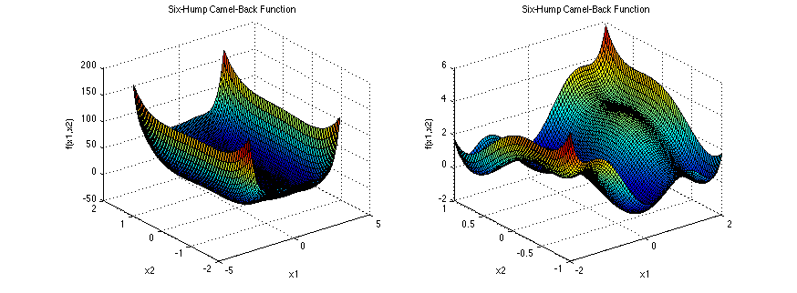
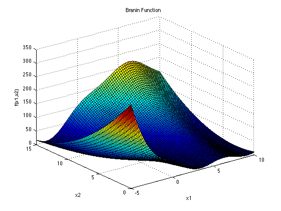

# Benchmarking

## Test functions

For the purpose of benchmarking I have used following functions.

- Simple

Primitive, one dimensional function `f(x) = x ^ 2`.

- Six hump camel function

Visualization:

- Branin function

Visualization:

## Compare implementations

I am benchmarking my solution against the same algorithm implemented in tensorflow for python. The alternative solution may be found behind this link (https://github.com/srom/cma-es).

## Methodology and benchmarking platform

For the purpose of benchmarking I have used the hyperfine (https://github.com/sharkdp/hyperfine) tool, running tests asserting successful execution of the algorithm on test functions mentioned before. Tests for both implementations have been run 20 times.

## Results

Following results have been obtained.

| Implementation | Time mean         | Time min | Time max |
|----------------|-------------------|----------|----------|
| Elixir NX      | 1.83 s +- 0.069 s | 1.73 s   | 2.00 s   |
| Python         | 5.02 s +- 0.094 s | 4.85 s   | 5.18 s   |

